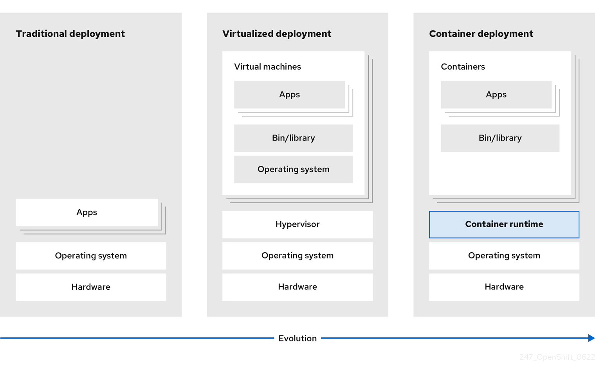

# Java Self-study Guide

## Java Core

## Object-Oriented Programming (OOP)

## Functional Programming

## SQL & NoSQL Databases

## Spring Framework

## Spring IoC

## Spring MVC

## Spring Data

## Spring Test

## Spring Boot

## Spring Transaction

## Spring Security

## Related Backend Topics

## REST & GraphQL

## Kubernetes & OpenShift
- ### Kubernetes
  - <b>Kubernetes</b> is an open source container orchestration engine for automating deployment, scaling, and management of containerized applications.
  - Traditionally, applications were deployed on top of a single operating system. With virtualization, you can split the physical host into several virtual hosts. Working on virtual instances on shared resources is not optimal for efficiency and scalability. Because a virtual machine (VM) consumes as many resources as a physical machine, providing resources to a VM such as CPU, RAM, and storage can be expensive. Also, you might see your application degrading in performance due to virtual instance usage on shared resources.
   
  - To solve this problem, you can use containerization technologies that segregate applications in a containerized environment. Similar to a VM, a container has its own filesystem, vCPU, memory, process space, dependencies, and more. Containers are decoupled from the underlying infrastructure, and are portable across clouds and OS distributions. Containers are inherently much lighter than a fully-featured OS, and are lightweight isolated processes that run on the operating system kernel. VMs are slower to boot, and are an abstraction of physical hardware. VMs run on a single machine with the help of a hypervisor. 
  - You can perform the following actions by using Kubernetes:
    - Sharing resources 
    - Orchestrating containers across multiple hosts 
    - Installing new hardware configurations 
    - Running health checks and self-healing applications 
    - Scaling containerized applications
    - [more](https://docs.openshift.com/container-platform/4.13/getting_started/kubernetes-overview.html)
- ### OpenShift Container Platform
  - <b>OpenShift Container Platform</b> is a platform for developing and deploying containerized applications.
  - <b>OpenShift Container Platform</b> is a cloud-based Kubernetes container platform. The foundation of OpenShift Container Platform is based on Kubernetes and therefore shares the same technology. It is designed to allow applications and the data centers that support them to expand from just a few machines and applications to thousands of machines that serve millions of clients.
  - OpenShift Container Platform enables you to do the following:
    - Provide developers and IT organizations with cloud application platforms that can be used for deploying applications on secure and scalable resources.
    - Require minimal configuration and management overhead.
    - Bring the Kubernetes platform to customer data centers and cloud.
    - Meet security, privacy, compliance, and governance requirements.
    - [more](https://docs.openshift.com/container-platform/4.13/getting_started/openshift-overview.html)
- 

## Kafka & RabbitMQ

## Docker

## Performance Tuning

## SOLID

## Design Patterns